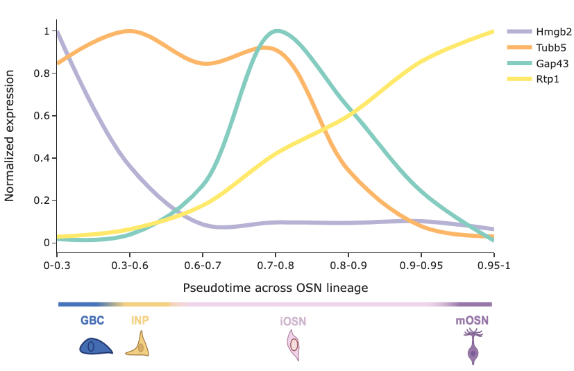
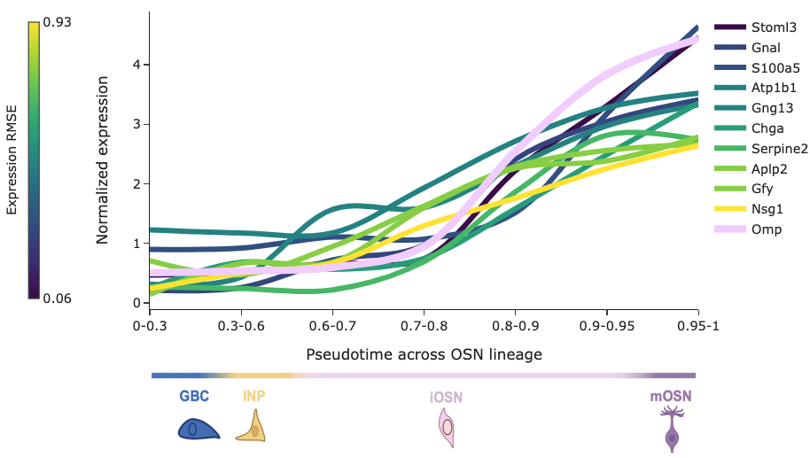
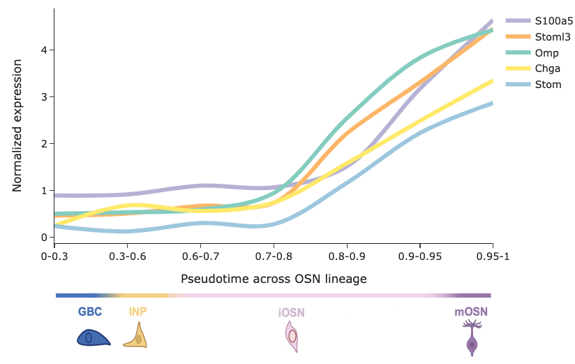

# geLine

Welcome to [geLine](https://github.com/Justice-Lu/geLine_dash). geLine is an interactive tool for visualizing gene expression trajectories across the neuronal lineage of olfactory sensory neurons (OSNs). The app is also hosted at [geLine on render](https://geline-dash.onrender.com/) for immediate usage. However, for faster response and usage, please follow the local usage instructions below.


## About geLine

geLine allows users to explore gene expression patterns in OSNs through various functionalities. Users can input a subject gene and query genes to generate detailed expression plots, find top genes co-expressed with the subject gene, and identify genes enriched in specific cell types.

### Key Features:

- **Subject Gene**: A single gene of interest.
- **Query Genes**: A list of genes to compare against the subject gene.
- **Y-axis**: Normalized gene expression. Every gene's expression count is normalized by its minimum and maximum counts.
- **X-axis**: Continuous value of diffusion pseudotime representing cell maturity in the OSN lineage.
- **Color/Hover**: Color and hover value display the Root Mean Square Error (RMSE) of the query gene's trajectory compared to the subject gene.

## Functionalities

### 1. Plotting Individual Genes

Users can select individual genes to visualize their expression trajectories. The plot displays the normalized expression values over pseudotime.



### 2. Finding Top Co-Expressed Genes

Users can identify genes that are most associated with the subject gene. This functionality highlights the top genes co-expressed with the query gene.



### 3. Enriched Genes in Specific Cell Stages

Users can toggle specific cell stages to find genes enriched in those stages. This helps in understanding gene expression patterns in different phases of OSN development.



## Parameters

### Plot Type

- **Logmaritize counts**: Log-transform the gene expression counts.
- **Normalize maximum expression**: Normalize gene expression to the maximum value.

### Input Gene

- **Subject Gene**: The reference gene against which other genes are compared. Selected from a dropdown menu.
- **Query Genes**: List of genes to visualize and compare against the subject gene. Multiple genes can be selected from a dropdown menu.

### Number of Most/Least Associated Genes

- **Most Associated Genes**: Range slider to select the number of genes most associated with the subject gene based on RMSE.
- **Least Associated Genes**: Range slider to select the number of genes least associated with the subject gene based on RMSE.

### Genes Enriched in Cell Type

- **Cell Types**: Checklist to select specific cell types (e.g., GBC, INP, early iOSN, late iOSN, mOSN) for identifying genes enriched in those stages.
- **Number of Enriched Genes**: Slider to select the number of top enriched genes to display.

## Getting Started

### Prerequisites

Ensure you have the following packages installed:

- pandas
- numpy
- matplotlib
- scikit-learn
- plotly
- dash

### Installation

Clone the repository:

```bash
git clone https://github.com/Justice-Lu/geLine_dash.git
```

Navigate to the project directory and install dependencies:

```bash
cd geLine_dash
pip install -r requirements.txt
```

### Running the App

Run the app locally:

```bash
python app.py
```

Open your browser and navigate to `http://127.0.0.1:8050/` to use the app.

## Usage

1. **Input Gene Selection**: Select a subject gene and query genes using the dropdown menus.
2. **Plot Configuration**: Choose plot types and configure options like log normalization and maximum expression normalization.
3. **Analyze Gene Expression**: Explore gene expression trajectories, find top co-expressed genes, and identify genes enriched in specific cell stages.

## Acknowledgements

The single-cell RNA-seq data used in this app is from [Brann et al.](https://www.science.org/doi/10.1126/sciadv.abc5801?url_ver=Z39.88-2003&rfr_id=ori:rid:crossref.org&rfr_dat=cr_pub%20%200pubmed) and reanalyzed using Python with the [scanpy](https://scanpy.readthedocs.io/en/stable/) library. The app is built with [Dash](https://dash.plotly.com/).


## Contact

For questions, please contact [Justice Lu](https://github.com/Justice-Lu).

Happy exploring with geLine!
